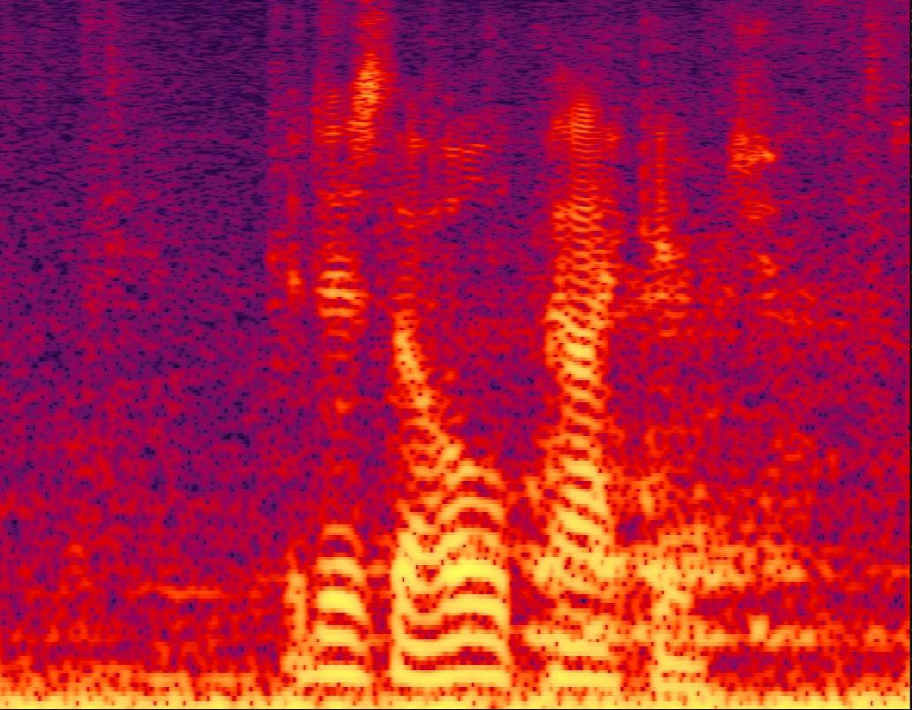
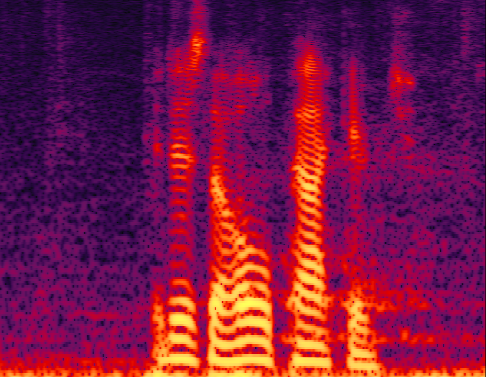

# 
 NADiffuSE: Noise-aware Diffusion Model and Conditional Domain-aligned Method for Speech Enhancement 

<!-- 
 Dongchao Yang1, Songxiang Liu2, Jianwei Yu2, Helin Wang3, Chao Weng2, Yuexian Zou1
 
 

 1 Peking University 

 2 Tencent AI Lab

 3 Johns Hopkins University
 -->

## Introduction
This is a demo for our paper **_Noise-aware Diffusion Model and Conditional Domain-aligned Method for Speech Enhancement _**. In the following, we will show some enhanced audio samples by our proposed method. 

## The comprarison between enhanced audio samples by CDiffuSE and our NADiffuSE

#### p232_002

Data
| 
Clean
 | 
Noisy
 | 
CDiffuSE 
 | 
NADiffuSE 
 | 
| ----------- | ----------- | ----------- | ----------- | ----------- |

Waveform
|<audio src="p232_002/clean.wav" controls preload></audio> | <audio src="p232_002/noisy.wav" controls preload></audio> | <audio src="p232_002/CDiffuSE.wav" controls preload></audio> | <audio src="p232_002/NADiffuSE.wav" controls preload></audio> |

Spectrogram
|</img> | </img> | </img> | </img> |

#### p232_186

Data
| 
Clean
 | 
Noisy
 | 
CDiffuSE 
 | 
NADiffuSE 
 | 
| -----------| ----------- | ----------- | ----------- | ----------- |

Waveform
|<audio src="p232_186/clean.wav" controls preload></audio> | <audio src="p232_186/noisy.wav" controls preload></audio> | <audio src="p232_186/CDiffuSE.wav" controls preload></audio> | <audio src="p232_186/NADiffuSE.wav" controls preload></audio> |

Spectrogram
|</img> | </img> | </img> | </img> |

#### p232_195

Data
| 
Clean
 | 
Noisy
 | 
CDiffuSE 
 | 
NADiffuSE 
 | 
| -----------| ----------- | ----------- | ----------- | ----------- |

Waveform
|<audio src="p232_195/clean.wav" controls preload></audio> | <audio src="p232_195/noisy.wav" controls preload></audio> | <audio src="p232_195/CDiffuSE.wav" controls preload></audio> | <audio src="p232_195/NADiffuSE.wav" controls preload></audio> |

Spectrogram
|</img> | </img> | </img> | </img> |

#### p257_065

Data
| 
Clean
 | 
Noisy
 | 
CDiffuSE 
 | 
NADiffuSE 
 | 
| -----------| ----------- | ----------- | ----------- | ----------- |

Waveform
|<audio src="p257_065/clean.wav" controls preload></audio> | <audio src="p257_065/noisy.wav" controls preload></audio> | <audio src="p257_065/CDiffuSE.wav" controls preload></audio> | <audio src="p257_065/NADiffuSE.wav" controls preload></audio> |

Spectrogram
|</img> | </img> | </img> | </img> |

#### p257_421

Data
| 
Clean
 | 
Noisy
 | 
CDiffuSE 
 | 
NADiffuSE 
 | 
| -----------| ----------- | ----------- | ----------- | ----------- |

Waveform
|<audio src="p257_421/clean.wav" controls preload></audio> | <audio src="p257_421/noisy.wav" controls preload></audio> | <audio src="p257_421/CDiffuSE.wav" controls preload></audio> | <audio src="p257_421/NADiffuSE.wav" controls preload></audio> |

Spectrogram
|</img> | </img> | </img> | </img> |

<!-- ## Links

[[Paper]()] [[Bibtex]()] [[Demo GitHub](https://github.com/yangdongchao/NoreSpeech_demo)] [[TencentAILab](https://ai.tencent.com/ailab/zh/index)] [[PKU](https://www.pku.edu.cn/)] [[code](https://github.com/yangdongchao/NoreSpeech)] -->

